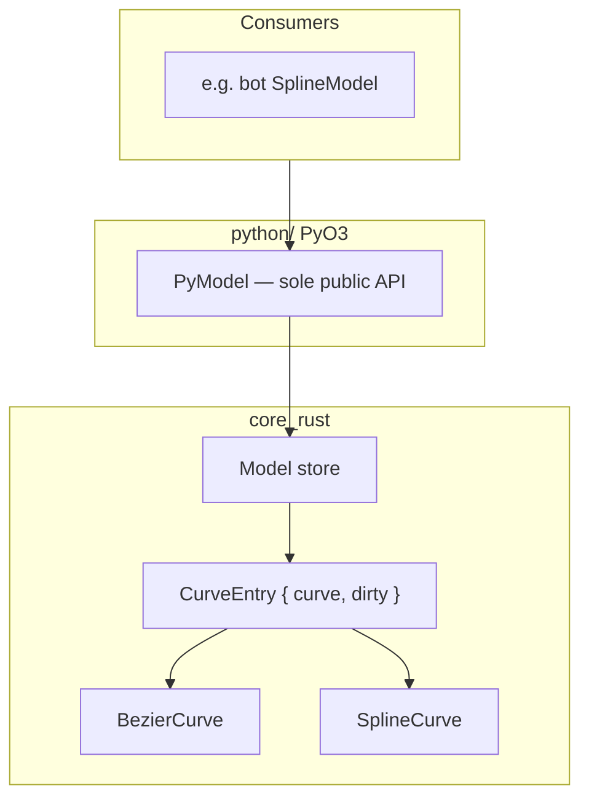
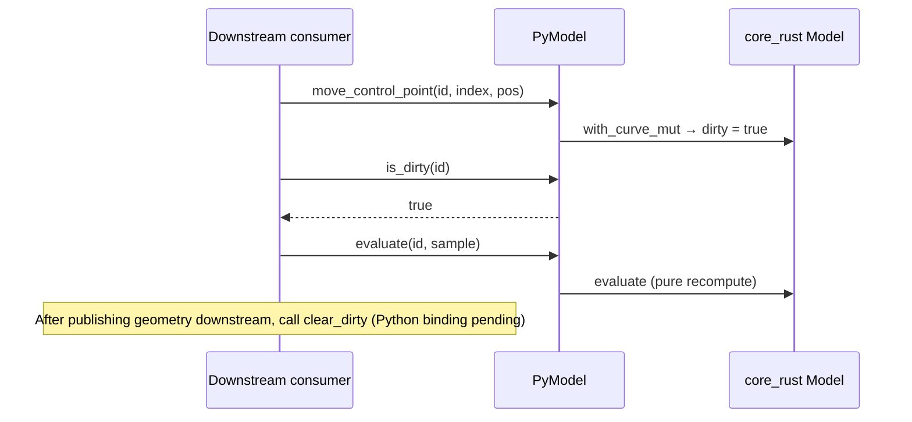
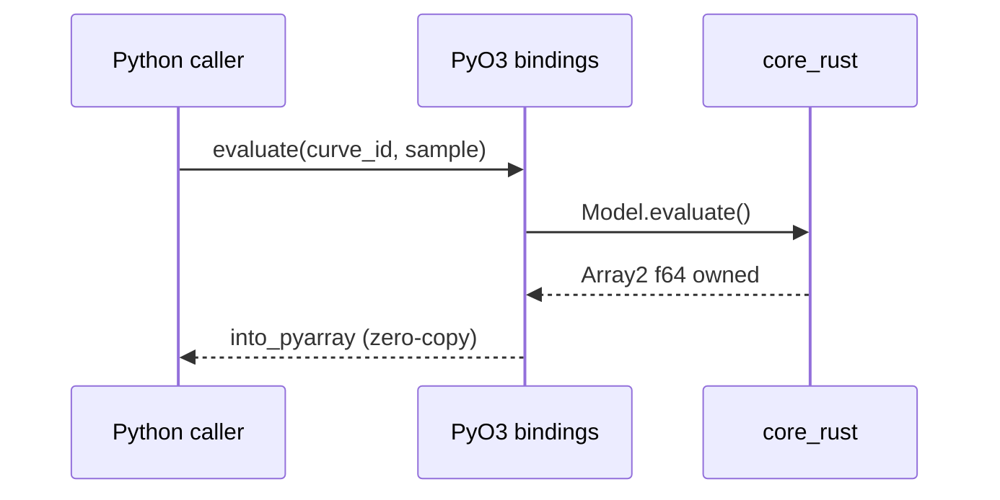
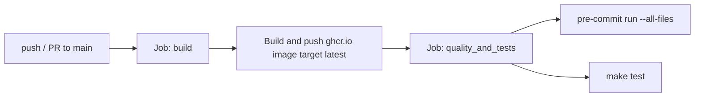

# FerriSpline — Technical Reference V1

This document is the authoritative technical reference for FerriSpline V1. It describes the hybrid Rust/Python architecture, build and deployment procedures, core mechanisms, public API, and development workflow. All content is derived from the source code in this repository.

**Target audience:** engineers, developers, and researchers working on Linux.

**Public API:** `ferrispline.PyModel` is the sole supported integration surface. All examples and contracts in this document refer to `PyModel` unless explicitly noted otherwise.

---

## Table of contents

1. [System Overview](#1-system-overview)
2. [Getting Started](#2-getting-started)
3. [Core Mechanisms](#3-core-mechanisms)
4. [API Reference](#4-api-reference)
5. [Development and CI/CD](#5-development-and-cicd)

---

## 1. System Overview

### 1.1 Architecture

FerriSpline separates intensive geometric computation from language bindings and reference tooling. The workspace is organised as a Cargo monorepo with three functional areas:

| Component | Path | Role |
|---|---|---|
| Computational core | `core_rust/` | Pure Rust NURBS/Bézier algorithms, `Model` store, dirty tracking |
| Python bindings | `python/` | PyO3 extension compiled by Maturin; module name `ferrispline` |
| Sandbox | `sandbox_python/` | Pure-Python reference implementation, VTK I/O, matplotlib visualisation |



Downstream applications (for example the parent project `bot`) must interact with FerriSpline exclusively through `PyModel`. The core owns all persistent geometry; consumers hold only references (curve IDs) and ephemeral derived data (evaluated point arrays).

### 1.2 Curve kinds

FerriSpline V1 supports two parametric curve representations, unified under a single store:

- **Bézier curves** — defined by degree, control points `(N, 3)`, and optional rational weights `(N,)`. Evaluated via Bernstein polynomials; rational evaluation when any weight differs from 1.0.
- **NURBS / B-spline curves** — defined by degree, control points, knot vector, and optional weights. Evaluated via the Cox–De Boor algorithm with rational weighting.

Both kinds are stored in `core_rust::model::Model` as variants of the `Curve` enum and addressed by stable string IDs.

### 1.3 Identifier scheme

Curve IDs are UUID-based strings with a fixed prefix, defined in `core_rust/src/ids.rs`:

```
curve-<uuid>
```

`CurveId::try_from_str` validates the prefix and UUID format. Control-point IDs (`curve-<uuid>.cp-<uuid>`) are defined in the core but not yet exposed through the Python API.

### 1.4 Geometry modules

Geometric algorithms live under `core_rust/src/geometry/` and are invoked internally by `Model`; they are not part of the public Python surface.

**Bézier (`geometry/bezier/`)**

| Module | Algorithms |
|---|---|
| `evaluation.rs` | Bernstein basis evaluation, rational Bézier |
| `subdivision.rs` | De Casteljau subdivision (single split and uniform segments) |
| `degree.rs` | Degree elevation and reduction |
| `conversion.rs` | Representation conversion (Bézier → NURBS: stubbed) |
| `control_points.rs` | Control-point move, weight set |

**Spline / NURBS (`geometry/spline/`)**

| Module | Algorithms |
|---|---|
| `evaluation.rs` | Cox–De Boor basis, rational NURBS evaluation |
| `extraction.rs` | NURBS → Bézier segment extraction (Boehm knot-insertion matrix) |
| `knots.rs` | Knot insertion and removal (stubbed) |
| `degree.rs` | Spline degree elevation/reduction (stubbed) |
| `control_points.rs` | Control-point mutation on splines (stubbed) |

**Knot vector (`core/knot.rs`)**

`KnotVector` validates non-decreasing knot sequences and enforces the relation `m = n + p + 1` (knot index range, control-point count, degree).

### 1.5 Implementation status

The following table reflects the state of the codebase at V1. APIs marked **Stubbed** are present on `Model` / `PyModel` but delegate to `todo!()` in the spline subsystem or conversion layer.

| Capability | Status |
|---|---|
| Multi-curve `Model` store with string IDs | Implemented |
| Bézier evaluate, subdivision, degree elevation | Implemented |
| NURBS evaluate (Cox–De Boor, rational) | Implemented |
| NURBS → Bézier extraction (`convert` to `"bezier"`) | Implemented |
| Dirty tracking on create and mutation | Implemented |
| `is_dirty` exposed on `PyModel` | Implemented |
| Knot insert / remove | Stubbed |
| Spline control-point move / weight set | Stubbed |
| Spline degree change | Stubbed |
| Bézier → NURBS conversion (`convert` to `"nurbs"`) | Stubbed |
| `clear_dirty` exposed on `PyModel` | Not yet (Rust only) |
| NURBS surfaces | Not in Rust core (sandbox Python reference only) |

---

## 2. Getting Started

### 2.1 Prerequisites

| Requirement | Version / notes |
|---|---|
| Rust | 2024 edition (`rustup` recommended) |
| Python | ≥ 3.8; Makefile prefers `python3.14` when available |
| Maturin | ≥ 1.5, < 2.0 (see `python/pyproject.toml`) |
| OpenGL | `libgl1` for sandbox VTK/matplotlib visualisation |
| Docker | Optional; used for reproducible CI and dev environments |

On Debian/Ubuntu:

```bash
sudo apt-get install -y build-essential python3-dev libgl1
```

### 2.2 Build path A — Maturin develop

Fastest iteration loop. Compiles the extension in debug mode and installs it into the active virtual environment:

```bash
cd python
maturin develop
```

Verify:

```python
import ferrispline
model = ferrispline.PyModel()
```

### 2.3 Build path B — Makefile

The Makefile at the repository root automates venv creation, release compilation, and wheel installation:

| Target | Action |
|---|---|
| `make venv` | Create `sandbox_python/.venv`, install pip, maturin, sandbox deps |
| `make build` | `maturin build --release` targeting the venv interpreter; force-reinstall wheel |
| `make test` | `cargo test` + `pytest sandbox_python/tests` |
| `make run <file.vtk> [samples]` | Run sandbox visualisation (`samples` defaults to 100) |
| `make clean` | Remove venv, Cargo targets, `__pycache__`, `.so`/`.whl` artefacts |
| `make rebuild` | `clean` then `build` |

Example:

```bash
make build
make run sandbox_python/vtk/simple_curve.vtk 200
```

### 2.4 Docker deployment

The multi-stage `Dockerfile` provides two relevant targets:

| Target | Purpose |
|---|---|
| `latest` | CI runtime: Rust, maturin, pre-commit, pytest, PyVista |
| `dev` | Interactive development: adds vim, ssh, non-root user |

Build a development image:

```bash
BRANCH_SLUG="$(git rev-parse --abbrev-ref HEAD | sed 's/[^a-zA-Z0-9._-]/-/g')"
docker build --build-arg USER="${USER}" \
             --network=host \
             --tag "ghcr.io/LIHPC-Computational-Geometry/ferrispline:${BRANCH_SLUG}" \
             --target dev .
```

CI builds and pushes the `latest` target to `ghcr.io/<repository>:<branch-slug>` on every push and pull request to `main`.

### 2.5 Downstream integration

FerriSpline can be used standalone or as a dependency. The parent project `bot` declares a path dependency on `ferrispline/python` and wraps `PyModel` in `SplineModel` (`bot/core/spline.py`). Standalone usage does not require `bot`.

---

## 3. Core Mechanisms

### 3.1 Dirty-flag invalidation

Every curve in the `Model` store is wrapped in a `CurveEntry` that carries a boolean dirty flag:

```rust
struct CurveEntry {
    curve: Curve,
    dirty: bool,
}
```

The flag signals that downstream derived data (evaluated polylines, baked render buffers) may be stale relative to the authoritative geometry held in the core.

#### Lifecycle

| Event | `dirty` value | Mechanism |
|---|---|---|
| Curve created | `true` | `add_curve` inserts a new `CurveEntry` |
| Mutation | set `true` | `with_curve_mut` after any successful in-place change |
| Batch mutation | set `true` on all affected IDs | `with_curves_mut` (used by `convert`) |
| Read (`evaluate`, `get_control_points`, `get_degree`) | unchanged | Pure reads do not modify state |
| Explicit acknowledgment | set `false` | `Model::clear_dirty` (Rust API only) |

Mutations routed through `with_curve_mut` include:

- `move_control_point`
- `set_control_point_weight`
- `set_degree`
- `insert_knot`
- `remove_knot`

#### Consumer contract



`PyModel.is_dirty(curve_id) -> bool` is the authoritative invalidation query exposed to Python. `Model::clear_dirty` exists in Rust but is not yet bound to `PyModel`; consumers should treat this as a planned V1 addition.

Current downstream integrations may use alternative notification mechanisms (for example observer callbacks). The dirty flag is the intended long-term contract: query before re-evaluating, acknowledge after publishing.

### 3.2 PyO3 data transfer

FerriSpline transfers numeric data between Rust and Python through NumPy arrays. This is an in-process FFI mechanism, not cross-process IPC.

#### Input path (Python → Rust)

Methods on `PyModel` accept `PyReadonlyArray1<f64>` and `PyReadonlyArray2<f64>` for control points, weights, and positions. The bindings call `.as_array().to_owned()`, which copies data into owned `ndarray` structures on the Rust side. This copy is intentional: it decouples Python buffer lifetime from Rust computation.

#### Output path (Rust → Python)

Evaluation and query methods return owned `Array2<f64>` buffers transferred to NumPy via `into_pyarray(py)`. This hands ownership of the underlying memory to Python without an additional copy:

- `evaluate(curve_id, sample)` → `(sample, 3)`
- `get_control_points(curve_id)` → `(N, 3)`
- `preview_evaluate(...)` → `(sample, 3)`

#### Conventions

| Quantity | dtype | Shape |
|---|---|---|
| Control-point positions | `float64` | `(N, 3)` |
| Weights | `float64` | `(N,)` |
| Knot vector | `list[float]` (Python input) | length `m + 1` |
| Evaluated samples | `float64` | `(sample, 3)` |

Coordinates are 3D Cartesian `[x, y, z]`. Errors are raised as `ValueError` with descriptive strings from the core.



---

## 4. API Reference

### 4.1 Module

```python
import ferrispline
```

Exported classes: `PyModel` (public API), `PyBezierCurve`, `PySplineCurve` (internal; see [Appendix A](#appendix-a-legacy--internal-classes)).

### 4.2 `ferrispline.PyModel`

#### Constructor

```python
PyModel() -> PyModel
```

Creates an empty curve store.

#### Methods

| Method | Signature | Dirty effect | Status |
|---|---|---|---|
| `create_bezier` | `(degree: int, control_points: ndarray[(N,3)], weights: ndarray[(N,)] \| None = None) -> str` | New curve, `dirty=True` | Implemented |
| `create_nurbs` | `(degree: int, control_points: ndarray[(N,3)], knots: list[float], weights: ndarray[(N,)] \| None = None) -> str` | New curve, `dirty=True` | Implemented |
| `delete_curve` | `(curve_id: str) -> bool` | Removes entry | Implemented |
| `evaluate` | `(curve_id: str, sample: int) -> ndarray[(sample,3)]` | Read-only | Implemented |
| `preview_evaluate` | `(kind: str, degree: int, cp: ndarray, cp_w=None, knots=None, sample: int) -> ndarray` | Stateless; no store | Implemented |
| `get_control_points` | `(curve_id: str) -> ndarray[(N,3)]` | Read-only | Implemented |
| `get_degree` | `(curve_id: str) -> int` | Read-only | Implemented |
| `convert` | `(curve_ids: list[str], new_kind: str) -> list[str]` | Marks affected curves dirty | Partial |
| `move_control_point` | `(curve_id: str, index: int, new_pos: ndarray[(3,)]) -> None` | `dirty=True` | Partial |
| `set_control_point_weight` | `(curve_id: str, index: int, weight: float) -> None` | `dirty=True` | Partial |
| `is_dirty` | `(curve_id: str) -> bool` | Read-only | Implemented |

**Partial** methods are fully operational on Bézier curves. On NURBS curves, control-point mutation and knot operations delegate to stubbed spline implementations and will panic at runtime if invoked before implementation is completed. `convert(..., "nurbs")` is stubbed; `convert(..., "bezier")` performs NURBS → Bézier extraction.

#### Parameter notes

- `kind` / `new_kind`: `"bezier"` or `"nurbs"` (case-sensitive).
- `curve_id`: must match `curve-<uuid>` format; invalid IDs raise `ValueError`.
- `knots`: non-decreasing sequence; length must satisfy `m = n + p + 1`.
- `sample`: number of uniformly spaced parameter samples over the curve domain.

### 4.3 Examples

#### Bézier curve

```python
import numpy as np
import ferrispline

model = ferrispline.PyModel()
cp = np.array([
    [0.0, 0.0, 0.0],
    [1.0, 2.0, 0.0],
    [2.0, 0.0, 0.0],
    [3.0, 1.0, 0.0],
], dtype=np.float64)

curve_id = model.create_bezier(3, cp)
print(model.is_dirty(curve_id))       # True
print(model.get_degree(curve_id))     # 3
points = model.evaluate(curve_id, 100) # shape (100, 3)

model.move_control_point(curve_id, 1, np.array([1.0, 3.0, 0.0]))
print(model.is_dirty(curve_id))       # True
```

#### NURBS curve

```python
import numpy as np
import ferrispline

model = ferrispline.PyModel()
degree = 2
cp = np.array([
    [0.0, 0.0, 0.0],
    [1.0, 1.0, 0.0],
    [2.0, 0.0, 0.0],
    [3.0, 1.0, 0.0],
], dtype=np.float64)
# Clamped knot vector for 4 control points, degree 2: m = n + p + 1 = 6
knots = [0.0, 0.0, 0.0, 1.0, 1.0, 1.0]

curve_id = model.create_nurbs(degree, cp, knots)
points = model.evaluate(curve_id, 50)

# Extract equivalent Bézier segments
bezier_ids = model.convert([curve_id], "bezier")
```

#### Stateless preview

Evaluate geometry without storing it in the model:

```python
pts = model.preview_evaluate("bezier", 2, cp, sample=20)
```

### 4.4 Error handling

| Condition | Exception |
|---|---|
| Invalid `curve_id` format | `ValueError` |
| Unknown `curve_id` | `ValueError` (wraps `ModelError::CurveNotFound`) |
| Invalid knot vector (non-monotonic, length mismatch) | `ValueError` |
| Invalid `kind` string | `ValueError` |
| Stubbed operation invoked | Rust panic (`todo!()`) — treat as not yet available |

### Appendix A — Legacy / internal classes

`PyBezierCurve` and `PySplineCurve` are registered in the compiled module (`python/src/lib.rs`) for sandbox and internal testing. They are **not** part of the V1 public API. External code must not instantiate them directly; all integration must go through `PyModel`. These classes may be removed from the public module surface in a future release.

### Appendix B — Rust `Model` API

For contributors working in `core_rust`, the store API in `core_rust/src/model.rs` mirrors `PyModel`:

| Rust method | Notes |
|---|---|
| `Model::new()` | Empty store |
| `create_bezier` / `create_nurbs` | Returns `CurveId` |
| `delete_curve` | Returns `bool` |
| `evaluate` | Pure read |
| `preview_evaluate` | Static; no store |
| `curve_kind` | `CurveKind::Bezier` or `CurveKind::Nurbs` |
| `get_control_points` / `get_degree` | Pure read |
| `is_dirty` / `clear_dirty` | Invalidation query and acknowledgment |
| `with_curve_mut` | Mutation entry point; sets dirty |
| `convert` | Kind conversion |
| `move_control_point` / `set_control_point_weight` | Per-curve mutation |
| `insert_knot` / `remove_knot` | NURBS only; stubbed |
| `set_degree` | Bézier implemented; NURBS stubbed |

---

## 5. Development and CI/CD

### 5.1 Local development workflow

1. Clone the repository.
2. Build: `make build` or `cd python && maturin develop`.
3. Install pre-commit hooks: `pre-commit install` (optional but recommended).
4. Create a branch: `feature/<name>`, `fix/<name>`, `docs/<name>`, `test/<name>`, or `refactor/<name>`.
5. Make changes; extend tests in `core_rust` (`#[test]` modules) and `sandbox_python/tests/`.
6. Run quality gates before pushing:

```bash
pre-commit run --all-files
make test
```

7. Open a pull request against `main`. CI must pass before merge.

### 5.2 Tooling

| Tool | Role | Configuration |
|---|---|---|
| `cargo fmt` | Rust formatting | `.pre-commit-config.yaml` |
| `cargo check` | Rust compilation check | `.pre-commit-config.yaml` |
| `clippy` | Rust linting | `.pre-commit-config.yaml` |
| `ruff` / `ruff-format` | Python linting and formatting | `.pre-commit-config.yaml` |
| `pre-commit` | Orchestrates all hooks | `.pre-commit-config.yaml` |
| `maturin` | Builds PyO3 extension | `python/pyproject.toml` |
| `cargo test` | Rust unit tests | Workspace root |
| `pytest` | Python sandbox tests | `sandbox_python/tests/` |
| `docker` | Reproducible CI/dev environment | `Dockerfile` |

Pre-commit hooks also enforce: no large files, JSON/YAML validity, no merge conflict markers, EOF fixer, trailing whitespace removal, and a branch-name guard (`no-commit-to-branch` on `main`).

### 5.3 CI pipeline

The workflow file `.github/workflows/ci-pipeline.yml` defines a two-stage pipeline triggered on push and pull requests to `main`:



**Job `build`**

- Checkout source
- Slugify branch name for image tagging
- Build and push Docker image (`target: latest`) to `ghcr.io/<repository>:<branch-slug>`
- Enable GitHub Actions cache for Docker layers

**Job `quality_and_tests`** (depends on `build`)

- Runs inside the freshly pushed container image
- Fixes Git safe-directory ownership for the checkout
- Executes `pre-commit run --all-files`
- Executes `make test` (`cargo test` + `pytest`)

Pull requests must pass both jobs. Direct pushes to `main` are discouraged; the `no-commit-to-branch` pre-commit hook enforces this locally.

### 5.4 Public API policy

All new features must be exposed through `PyModel`. Do not expand the surface of `PyBezierCurve` or `PySplineCurve`. When adding Python bindings for Rust functionality (for example `clear_dirty`), add methods to `PyModel` in `python/src/model.rs`.

Document implementation status honestly: do not describe stubbed operations as available. Refer to the [implementation status table](#15-implementation-status) when adding or modifying API documentation.

### 5.5 Commit conventions

Use [Conventional Commits](https://www.conventionalcommits.org/):

```
feat: add clear_dirty binding to PyModel
fix: validate knot vector length on create_nurbs
docs: update technical reference for convert API
test: add model dirty-flag integration test
chore: bump maturin lower bound
```

See [CONTRIBUTING.md](../CONTRIBUTING.md) for the full contribution guide.
